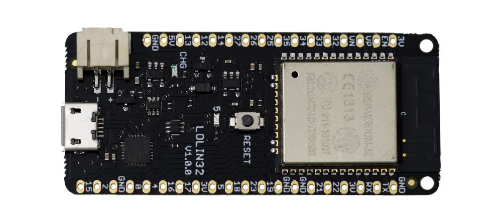

# ESP32-Long-Range-WiFi

These are the first tests with espressif's proprietary **802.11 LR (Long Range)** protocol of the ESP32.
The devices used are two [Wemos lolin32](https://wiki.wemos.cc/products:lolin32:lolin32), old ones.

The scenario is the following:

* One of the lolin32 is configured as **master** in STA and AP mode. First it connects to the traditional router and obtains an IP from it. Then create an access point in 802.11 Long Range mode, with an ssid called "kkkkk". This access point is not visible by normal devices, since I don't think they can detect the protocol. The IP in mode is 192.168.4.1.

The master cyclically sends the 'b' command via UDP, to the broadcast address 192.168.4.255.

* The other lolin32 is configured as **slave**, in STA mode. It connects to the ssid "kkkkk" and obtains its IP, probably 192.168.4.2.
Every time the 'b' command arrives, the LED connected to GPIO5 changes state. If there is no reception there is no change.

To achieve a good range the two units must be in line of sight. The lolin32 antennas are of the [MIFA](https://en.wikipedia.org/wiki/Inverted-F_antenna) type and their maximum radiation is in this direction:

In a first test, which surely could be improved, I achieved 294 m of range. I hope to overcome this distance by a few meters. 

Update **346 m**.

It is to be expected that with external or directional antennas the 1 kilometer indicated by espressif could be reached.

Advice and proposals are accepted.
